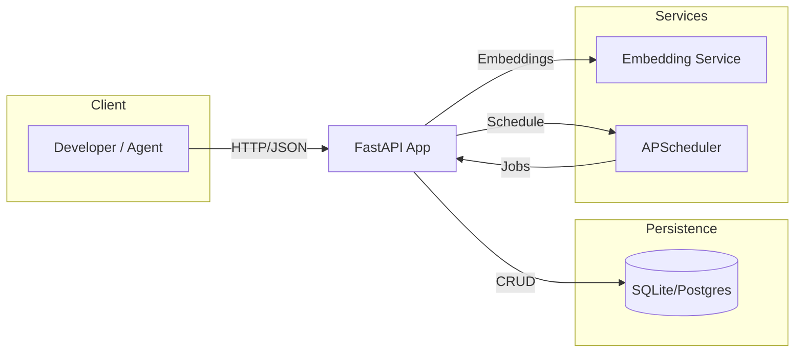

# DMA Architecture Diagram

- API: `backend/api/main.py`, routers under `backend/api/routes/*`
- DB: async SQLAlchemy session/engine in `backend/models/base.py`
- Embeddings: `backend/services/embedding_service.py`
- Scheduler: `backend/services/scheduler.py`
- Retrieval: `backend/services/retrieval_service.py`
